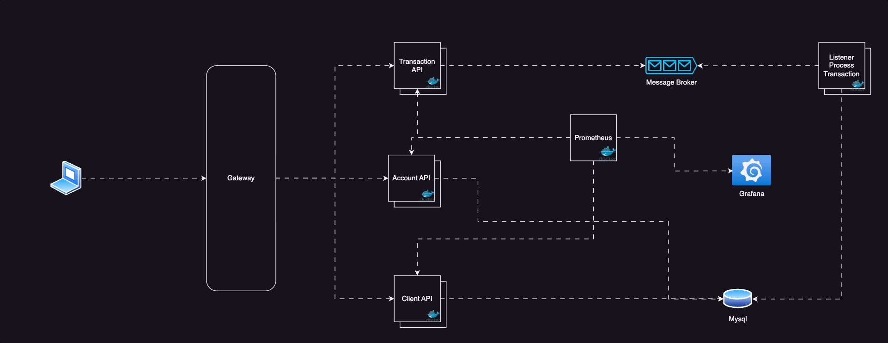

# Documentação de Arquitetura

### Arquitetura do Sistema de Lançamento de Transações

## Gateway

A borda das APIs teremos um Gateway onde vai administrar as requisições que chegam, além de fazer um papel de Load Balancer, o Gateway terá politicas de acesso para garantir a resiliência da Aplicação.

###### Sugestão

- Usar Kong como Gateway [Kong](https://konghq.com/)

## Camada de APIs

Está camada é onde teremos as APIs Rest, toda a API deve ser implementada seguindo o [Modelo de Maturidade de Richardson](https://martinfowler.com/articles/richardsonMaturityModel.html), as requisições recebidas pelo microserviço de transação são enviados para um [Broker RabbitMQ](https://www.rabbitmq.com/) Isso ocorre porque teremos um volume maior de requisições nesta API e para garantir uma baixa latência e um alto throughpt foi pensado o uso de mensageria.

## Camada de Mensageria

Para que exista uma baixa Latência e um alto Throughpt e que também nos permita trabalhar de forma resiliente, foi pensado o uso de mensageria usando o RabbitMQ como ferramenta de mensageria.

## Listeners

Os listeners são responsáveis por obterem as mensagens do broker e processar, os listeners precisam ser resilentes e devem manter os dados consistêntes.

## Banco de dados

O Banco de dados escolhido para se trabalhar foi o Mysql. Pela grande volumetria e facilidade de se trabalhar, o Mysql foi escolhido em vez de se usar um banco de dados NoSql.

## Prometheus

O prometheus será responsável por colher informações referente a saúde da aplicação e do processamento, é por aí que teremos informações de quantas requisições deram errado, quantos foram com sucesso, etc.

## Grafana

Grafana vai exibir as informações coletadas pelo prometheus, é por lá que poderemos visualizar a saúde da aplicação em graficos.

#### Referências

[Richardson Maturity Model](https://martinfowler.com/articles/richardsonMaturityModel.html)

[Medindo a Maturidade de sua API - Richardson Maturity Model](https://www.brunobrito.net.br/richardson-maturity-model/)

[Modelo de maturidade de Richardson para APIs REST](https://rivaildojunior.medium.com/modelo-de-maturidade-de-richardson-para-apis-rest-8845f93b288)

[O que é mensageria e o que eu ganho com isso? | Sensedia](https://www.sensedia.com.br/post/o-que-e-mensageria-tudo-o-que-voce-precisa-saber)

[API gateway com Kong](https://medium.com/aurum-tech/api-gateway-com-kong-147817cd502)

[Mysql](https://www.mysql.com/)
