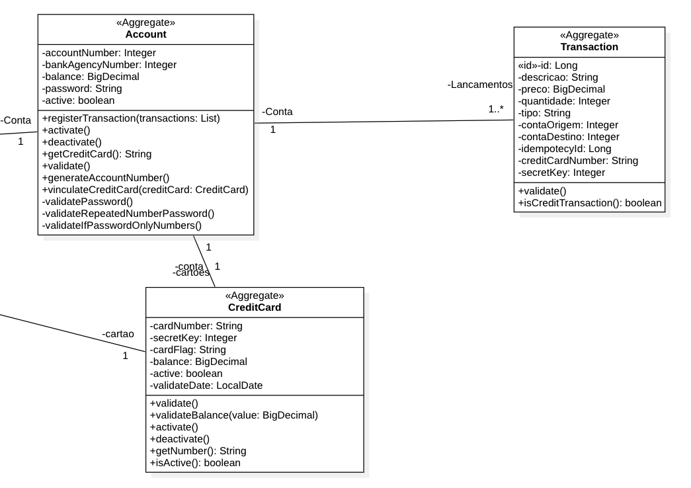

# Modelagem do Desafio de transações

### Objetivos

Principal objetivo é atender os pontos abaixo

- [ ] Sistemas distribuídos concorrentes  
- [ ] Rastreabilidade  
- [ ] Idempotência  
- [ ] Tolerância a falhas  
- [ ] Padrões Arquiteturais  
- [ ] Concorrência

### Modelagem dos Pacotes


----

#### Core Module


Aqui é o modulo responsavel por armazenar os modulos de regra de negocio separados por dominios. Detro do Core Module temos dois modulos principais para regra de negocio.

----

##### Shared Business Module

Aqui acopla as interfaces que serão comuns entre todos os modulos de regra de negocio. Como por exemplo interfaces de validação, interfaces de marcação, etc.

----

##### Domain Business Module

Aqui acopla outros modulos que representam os Bounded Context do dominio da aplicação desenvolvida. Cada Bounded Context é um modulo próprio. Dentro deste Modulo iremos possuir dois Modulos (Bounded Context), O Modulo do Cliente (**Client Module**) e o Modulo de Conta Corrente (**Current Account Module**).

---

#### Application Module


Aqui é onde encontramos os modulos que representam os casos de uso da aplicação, é onde a camada de drivers irá consumir, lembrando que essa camada pode se comunicar diretamente com a camada de regra de negocio, porém toda a comunicação realizada para este modulo, deverá ser feita por portas (Ports), assim como recomenda a arquitetura hexagonal ([Hexagonal Architecture]([Hexagonal architecture &#8211; Alistair Cockburn](https://alistair.cockburn.us/hexagonal-architecture/))).

---

##### Shared Application Module

Aqui temos Classes e Interfaces que são comuns entre todos os modulos que representam o caso de uso. Lembrando que esse modulo é apenas para uso interno ao Modulo de Application.

---

##### Domain Application Module

Aqui temos os modulos que possuem os casos de uso da aplicação, é aqui que os Drivers se comunicam, toda comunicação relaizada para um caso de uso é realizado por uma Porta (Ports) assim como sugere a arquitetura hexagonal.

---

#### Adapter Module


Aqui é onde temos as interfaces e abstrações para adaptadores, quando um caso de uso precisar utilizar um banco de dados, um fila de mensageria, etc. É utilizado um adaptador, assim como o acesso dos casos de uso são realizados por meio de portas (Ports), os Adaptadores (Adapters) são usados por casos de uso para acesso externo a recursos ou aplicações externas.

---

#### Driver Module


Aqui é a camada onde podemos criar nossas APIs, Jobs, Listeners, Persistencia. Esse módulo permite a criação desses drivers usando framworks distintos, essa é a camada de infraestrutura que fornece recursos para usuários acessarem a aplicação.

### Modelagem da API de Lançamentos



### Fluxo do Transaction Business


Usuário envia os dados para lançamento, o dado é enviado no seguinte JSON

```json
{
    "accountNumber": 123,
    "bankNumber": 1234,
    "transactions": [
      "description": "abc",
      "price": 1.0,
      "transactionType": "CREDIT"
    ]
}
```

Um `json` que suporta para cada conta, diversas transações, essas transações precisam ser separadas pois o processamento de cada transação possui regras especificas.

Transaction Business precisa validar os dados de conta que são obrigatorios, caso um deles não seja informado, uma `exception` precisa ser lançada e o processo encerrado.

Também será necessario validar o `price` pois não é permitido o envio de valores negativos, nulos ou zerados.

Atualmente é permitido apenas os tipo `CREDIT` e `DEBIT` , qualquer valor diferente deve lançar uma `exception`

Os campos `description`  é opcional e aceita valores vazios caso seja enviados.

Após validação o Transaction Business precisa separar as transações em blocos de credito e blocos de debito.

Após separar os dados, eles são enviados para a camada de `Account Business`

### Fluxo do Account Business

Nesse fluxo a camada consulta no banco os dados as informações referente a conta.

Ao obter as informações inicia-se o processamento das transações, sempre do mais critico para o menos critico, ou seja, do `DEBIT` para o `CREDIT` 

O processamento inicia validando se o saldo é maior ou igual a soma das transações do tipo em processamento, comparar saldo de debito com a soma das transações de debito e Saldo de credito com soma das transações de credito.

O lançamento só poderá ocorrer caso seja possível registrar todas as transações, caso uma delas falhe por falta de saldo, toda a transação precisa ser cancelada e o saldo retornado.

O fluxo irá seguir a seguinte ordem:

1. Grava as transações de Debito

2. Grava as transações de Credito

3. Atualiza o saldo da Conta

Se qualquer erro ocorrer em qualquer das etapas, toda a transação deve ser cancelada imadiatamente.

### Fluxo de Consulta de Saldo

Neste fluxo a camada consulta os dados de saldo da conta, nessa consulta é necessário informar o bankNumber e o accoutNumber para que seja possível recuperar os saldos de credito e debito.

### Fluxo para Criação de Conta

Neste fluxo para se criar uma conta será necessário informar os dados de cliente, essa informação é informada manualmente, outra informação é em qual agencia o usuário deseja criar sua conta. O número da conta é gerado de forma automatica e não se pode repetir.

### Rastreabilidade

Deve ser possível rastrear todo o processamento dos dados, pra esse caso usa-se Logs, também pode ser usado uma forma de rastreabilidade usando o Prometheus e rastrear os processos de erros e sucessos.

##### Ferramentas para rastreabilidade

- Logs

- Prometheus

### Concorrência

O sistema deve evitar a corrida por dados e deve ser garantido a consistência entre os dados. lembrando que o processamento precisa se de forma paralela, deve-se usar Thread Safe.

##### Ferramentas para concorrência

- Threads (Pesquisar)

### Idempotência

O sistema deve ser Idempotente e garantir que não é possível gerar transações duplicatas na base.

### Tolerância a Falhas

Sistema deve ser Tolerânte a falhas e se recuperar de falhas graves.
